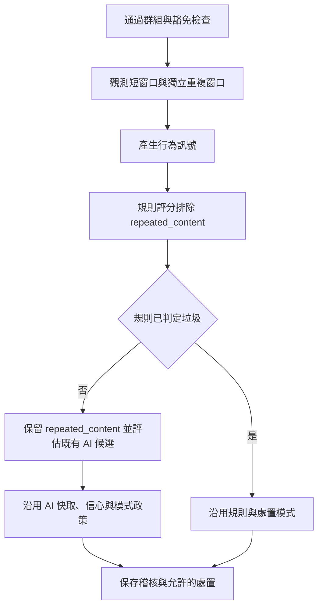

# 設計文件：獨立重複文案偵測窗口

## 設計摘要與文件定位

本設計落實 [requirements.md](requirements.md) 的 R1～R9。保留既有 1 分鐘短窗口，獨立管理 30 分鐘、3 則的重複狀態；維持 `BehaviorStore` port、AI 分類流程與既有 Telegram 處置。

在 domain 評分邊界將 `repeated_content` 定義為只供觀察的訊號，仍保留於 `Result.Signals`。此做法讓直接呼叫 Detector 的測試或其他呼叫者也受到相同安全限制，而不是只依賴目前 YAML 沒有引用該訊號。

本文件已與完成的實作對齊，驗證證據見 [tasks.md](tasks.md)。不改寫既有 OpenSpec 歷史、詞彙補強、AI provider 或管理員指令；尚未部署。

## 已知契約狀態

- 需求來源：使用者要求先產出 SDD，再以「task go」確認依 30m／3 則基準實作。
- API／CLI：`BehaviorStore.Observe(ctx, message, fingerprint) ([]string, error)` 已存在，輸出仍使用 `repeated_content`；不新增 Webhook 或 Bot 指令。
- 設定：新增 `Config.Behavior`（`BehaviorConfig`），沿用 Viper 的 ENV > YAML > 預設值。AI 預設停用，不能假造部署已啟用 AI。
- Data contract：原始 `message.Text` 透過 Processor 的 HMAC-SHA256 產生 fingerprint，並被稽核、AI 快取等流程共享。不改成正規化或語意指紋。
- 正式 adapter：`redis.NewBehaviorStore(client, time.Minute, redis.WithRepeatPolicy(cfg.Behavior.RepeatWindow, cfg.Behavior.RepeatThreshold))`，使用 `TxPipeline` 原子交易。
- 測試 adapter：`memory.NewStore(window, maxEntries)`，以 Mutex 保護短期狀態。
- 不可假造：未讀取真實設定或秘密值；不宣稱已知線上 AI 模式、Bot 權限、Redis 用量或部署副本時鐘。

## Bounded Context

包含：

- detection infra 的重複窗口、去重、過期及容量。
- detection domain 的觀察訊號評分隔離。
- config 的新政策欄位、啟動組裝及 sample／ENV 說明。
- AI／處置流程的回歸驗證，與需求、設計、任務文件。

不包含：

- 相似內容或繁簡等價指紋、跨帳號長窗口、歷史回掃。
- AI prompt／模型、快取 schema、分類策略改造。
- PostgreSQL migration、Telegram 權限或 `/purge` 修改。
- Redis Cluster 支援；現有正式組裝是一般 Redis Client。
- 全專案 lint 問題修復或自動發布。

## 設計原則

1. 不把短窗口的共用 `window` 直接改成 30 分鐘。
2. 窗口計數與 key TTL 分開理解；TTL 只負責回收，score 決定滑動窗口資格。
3. 唯一訊息以穩定 MessageID 辨識，原始紀錄仍保留時重送不刷新其首次 score；不承諾永久去重。
4. 重複訊號不是違規證據，不參與規則加分與封鎖必要條件。
5. 確定的規則垃圾仍可照既有政策處置；不能將全部重複訊息強制降成 observe。
6. 不新增依賴，使用已存在的 go-redis、miniredis、Viper 與測試慣例。

## 介面與設定契約

### 新增設定

```yaml
behavior:
  repeat_window: 30m
  repeat_threshold: 3
```

| 設定 | ENV | 預設 | 驗證 |
|------|-----|------|------|
| `behavior.repeat_window` | `BEHAVIOR_REPEAT_WINDOW` | `30m` | 1ms～24h，避免毫秒精度下的零窗口與過長保留 |
| `behavior.repeat_threshold` | `BEHAVIOR_REPEAT_THRESHOLD` | `3` | 2～100，包含當前唯一訊息 |

資源上限是本設計的安全限制，不是量測後的最佳政策。使用者未提供新區塊時仍使用新預設；明確給非法值則驗證失敗。既有 `TestValidate` 手動組裝 Config 的 fixture 須補上有效新政策。

Redis constructor 為 `NewBehaviorStore(client, window, opts ...BehaviorOption)`，保留原有兩參數呼叫方式，透過 `WithRepeatPolicy(window, threshold)` 注入重複政策；main 顯式傳入已驗證的 config。不傳 option 使用 30m／3，nil option 與非法政策回傳錯誤。

Memory 保留 `NewStore(window, maxEntries)` 簽章並採相同 30m／3 則預設。本輪不新增 Memory 對外設定入口；它是開發／測試用 adapter，非預設可調政策的驗證以正式 Redis adapter 為準。

### 輸入、輸出與錯誤

- 輸入仍是通過既有 delivery／豁免檢查的 `domain.Message` 與原始文字指紋。
- 輸出仍是行為訊號列表；第 3 則及之後、目前窗口內總數達門檻時包含一次 `repeated_content`。
- Redis／context 錯誤仍回傳上層，Processor 中止並釋放 update claim，允許 Webhook 重送。不改成靜默忽略儲存錯誤。
- AI 呼叫失敗仍沿用既有安全降級，與 Redis 儲存錯誤是不同契約。

## Redis 資料與原子流程

| 狀態 | Key | 保留與計數契約 |
|------|-----|----------------|
| 發送頻率 | `spam:frequency:<chatID>:<userID>` | 原有 1 分鐘／插入前第 4 則歷史門檻不變 |
| 重複文案 | `spam:repeat:v2:<chatID>:<userID>:<fingerprint>` | 新 namespace，獨立 repeatWindow／含當前計數 |
| 跨帳號協同 | `spam:content-users:<chatID>:<fingerprint>` | 原有 Set 與 1 分鐘續 TTL 語意不變 |

新 repeat ZSET 的 member 使用十進位 MessageID；key 本身已含 ChatID、UserID 與 fingerprint。score 是首次觀測的處理時刻 `UnixMilli()`。不保存原始文案。

一次 `TxPipeline`／MULTI-EXEC 內的重複操作依序為：

1. 移除 `score <= now - repeatWindow` 的紀錄。
2. 用 `ZADD NX` 插入穩定 member；已存在時不得修改 score。
3. 在插入後 `ZCARD`，計入當前唯一訊息。
4. 以 repeatWindow 更新 key TTL；再次觀測可續 key 的回收期限，但不得續舊事件的計數生命。
5. 結果 `count >= repeatThreshold` 時產生 `repeated_content`。

短窗口命令維持原先讀取／插入次序，不隨此功能改為新的頻率門檻。既有 TxPipeline 已是原子交易；不需要為了宣稱原子性而另導入 Lua 或交易外的讀取。新 ZSET 計數必須仍在交易內完成。

v2 namespace 避免與舊 `now.UnixNano():messageID` member 混用。舊 key 自然過期，不掃描或刪除 Redis 中其他資料。新歷史冷啟動、不回補 PostgreSQL 或 Telegram 舊訊息；滾動部署期間不能承諾新舊計數完全連續。

NX 只對仍存在的 member 生效。原始紀錄因窗口清除、TTL 或容量降級消失後，未完成訊息的延遲重試可重新插入並取得新觀測時間；本次不建立永久訊息去重表。已完成／正在處理的更新仍由既有 UpdateStore 管理。

時間取自現有可注入的 client `now`，以便測試左界。假設：副本時間同步；本次不宣稱已使用 Redis server time，也不修改短窗口時鐘來源。client 取樣順序不必等於交易順序：較早取樣的請求若較晚提交，ZCARD 可包含 score 大於該次 now 的已提交觀測，因此不保證相對 client now 的嚴格右界。計數依原子交易序列為準；並行第三則測試使用相同取樣時間，另外測試取樣／提交反序的已知行為。

## Memory 狀態與容量

- 與原有短窗口 `windows` 分離建立重複歷史，紀錄首次觀測時間、UserID、fingerprint 與 MessageID。
- 在同一 Mutex 範圍完成清除、去重、插入與含當前計數，重複窗口採與 Redis 相同的左開右閉邊界。
- 短窗口原有頻率、協同、入群訊號、maxEntries 與邊界不順便改造。
- 重複歷史另受每群 maxEntries 限制；沿用 maxEntries <= 0 無容量限制的既有語意。
- 有限容量超過上限時，不得用丟失去重資料後的重新累加製造可信重複計數。設計採該群重複狀態清除，固定設定 `cooldownUntil = overflowTime + repeatWindow`；冷卻期間不保存重複計數、不產生重複訊號，也不因持續流量延長冷卻期限。`now >= cooldownUntil` 的第一次觀測從空歷史重新開始；已丟棄的 MessageID 不再有永久去重資訊。短窗口與其他功能不受影響。
- 此容量降級只適用開發／測試 Memory adapter。容量不足會漏掉重複線索，不能將其轉成處置或假造已觀測 3 則。
- 既有測試有未指定 MessageID 的重複 fixture；改為代表真實多則訊息的不同 ID，不以重送同 ID 模擬 6 則訊息。

## 規則、AI 與處置邊界

domain Detector 保留所有可疑訊號於 `Result.Signals`，但另外建立可參與規則評分的訊號集合。`repeated_content` 不進該集合，因此不參與 `require_any` 加分、也不能滿足 ban 必要條件。其他訊號與詞彙計分保持不變，不改規則 YAML schema。

不在 application 丟掉重複訊號；既有 `AITriggerPolicy` 已把它當作弱可疑訊號。規則零分且非垃圾時可進入 AI 候選，明確規則垃圾仍跳過 AI。AI 停用時只保存線索，不為了重複而自行建立違規。

| AI 結果／政策 | 沿用的處理 |
|---------------|------------|
| 停用、ham、uncertain、低信心、不可用信心來源或 AI 失敗 | 不提升原規則垃圾判定 |
| 高信心 spam，AI observe | 保留 `ai_spam` 線索，不自行處置 |
| 高信心 spam，AI delete-only | 有效模式為 delete-only，只刪除、不推進違規階梯 |
| 高信心 spam，AI enforce，app observe | 只記錄 AI 線索 |
| 高信心 spam，AI enforce，其他 app 模式 | 一般 progressive 結果，處置仍受 app 模式與既有次數限制 |

注意：目前 AI delete-only 可使 app observe 的有效模式變成 delete-only；本輪保留此既有行為，不宣稱 app observe 一律覆蓋 AI 模式。AI 不會因重複訊號首次直接 critical／ban，但一般違規階梯後續仍可封鎖。

AI cache、claim、信心來源與 safe_action 的既有處理不變，不新增模型回覆欄位或額外採用條件。

## 目標流程



## 受影響檔案

| 檔案 | 已完成變更 | 風險 |
|------|----------|------|
| `internal/config/config.go`、`config_test.go` | 新設定、預設、ENV、驗證與相容測試 | 手動組裝 Config fixture 需同步 |
| `configs/config.sample.yaml`、`.env.example` | 公開安全範例與調整說明 | 不可寫入真實秘密值 |
| `cmd/tg-spam-bot/main.go` | 保留 time.Minute 並注入 repeat 政策 | 確保未把全域窗口一起延長 |
| `internal/detection/infra/redis/behavior.go`、新增 `behavior_test.go` | 獨立窗口、穩定 member、原子計數、TTL | 重送、跨副本與新 namespace 冷啟動 |
| `internal/detection/infra/memory/store.go`、`store_test.go` | 獨立重複狀態、去重、容量安全降級 | 不改短窗口及其他 Store 職責 |
| `internal/detection/domain/rules.go`、`detector_test.go` | 重複訊號只觀察，不參與處罰評分 | 需驗證 require_any 加分與 ban gate |
| `internal/detection/application/ai_policy_test.go`、`ai_processor_test.go`、`processor_test.go` | 候選、模式、失敗重試與豁免回歸 | 僅補測試，不改既有 AI 政策 |
| 本 spec 三份文件 | 任務狀態與驗證證據 | 不混用前一輪測試結果 |

## 需求對應與 Protected Behavior

- R1～R4：Redis／Memory 的獨立窗口、含當前計數、範圍 key、NX member、過期及並行測試。
- R5：短窗口、協同、豁免、UpdateStore 與明確垃圾回歸。
- R6～R7：domain 訊號隔離與既有 AI／處置政策。
- R8～R9：設定驗證、容量安全降級與儲存錯誤契約。
- 保護所有既有 AI credential、快取鍵、prompt、schema、豁免與正常違規階梯。
- 保留先前未提交的詞彙補強，不在本 spec 的實作任務順便修改。

## 替代方案

| 方案 | 結論與原因 |
|------|------------|
| 共用 window 全部改 30 分鐘 | 不採用；正常聊天會累積頻率，協同狀態也會被擴大 |
| 重複第三則直接刪除／封鎖 | 不採用；普通短句重複不等於垃圾訊息 |
| 只在 Processor 過濾重複訊號 | 不採用；domain 的其他呼叫者仍可把它作為加分／ban 證據 |
| 改成正規化或語意指紋 | 本次不採用；會同時改變稽核、AI cache、管理員批次清除的內容身份契約 |
| 新增 Lua | 不必要；既有 Redis 交易可承載 NX 後計數，不擴大腳本維護範圍 |

## 風險、驗證與實作注意事項

- 長保留量與 AI 候選增加：設定上限、清除過期 score、TTL、既有 cache；效能量測用合成事件，不聲稱已取得線上基準。
- 多副本時鐘與金鑰不一致：部署檢核，但不讀取或輸出秘密值。新舊版本混跑只有逐步累積的新歷史，不回溯合併；client 取樣／提交失序不提供嚴格右界。
- 相似但不同文案：保持精確指紋，明確列為剩餘召回限制。
- 訊息重送：Store 必須在原始紀錄保留期間自身去重，不能只依賴 UpdateStore，因下游失敗會 Release 並再次 Observe。超過窗口／TTL 後的未完成重試不承諾永久去重。
- 本次不修短窗口重送計數、協同 Set 的逐成員過期或 adapter 既有差異；它們不是長重複窗口交付範圍。
- Memory 超容量：冷卻期間只漏觀察訊號，測試確認沒有新增處罰或影響短窗口。
- 驗證 selector 與精確情境見 `requirements.md`、各任務 `Verify:`；任何超出邊界的必要修改需先更新 `tasks.md`。
